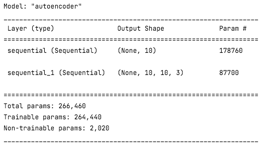
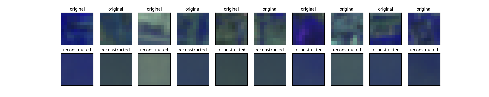

# Autoencoder 

An Autoencoder is an unsupervised learning neural network. It is primarily used for learning data compression and inherently learns an identity function. First introduced in the 1980s, it was promoted in a paper by Hinton & Salakhutdinov in 2006. An Autoencoder network aims to learn a generalized latent representation ( encoding ) of a dataset. Autoencoder is helpful in various domains, such as for processing image, text, and audio.

An autoencoder is composed of an encoder and a decoder sub-models. The encoder compresses the input and the decoder attempts to recreate the input from the compressed version provided by the encoder. After training, the encoder model is saved and the decoder is discarded.

The encoder can then be used as a data preparation technique to perform feature extraction on raw data that can be used to train a different machine learning model.

Autoencoder model summary 

Encoder model summary 

Decoder model summary 

